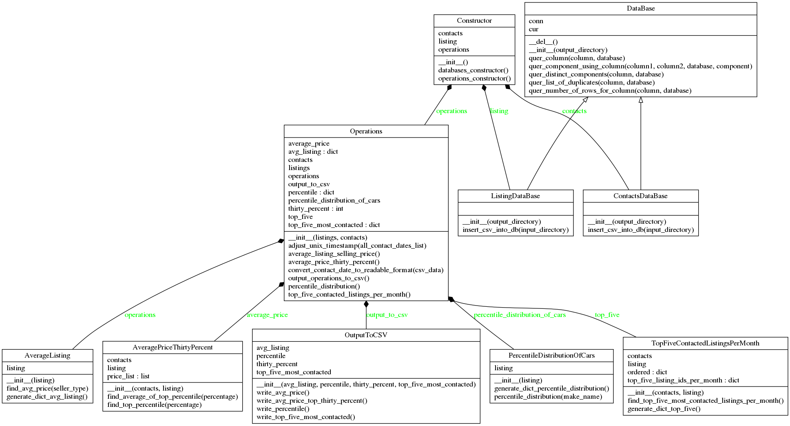

# AutoScot24


## Running the code

```bash
python3 main.py
```


## Testing the code

```bash
nosetests unittests/*.py
```


## Structure
- The csv files are transfered to databases
- Each operation is in a class
- unitests have their own tesr files


